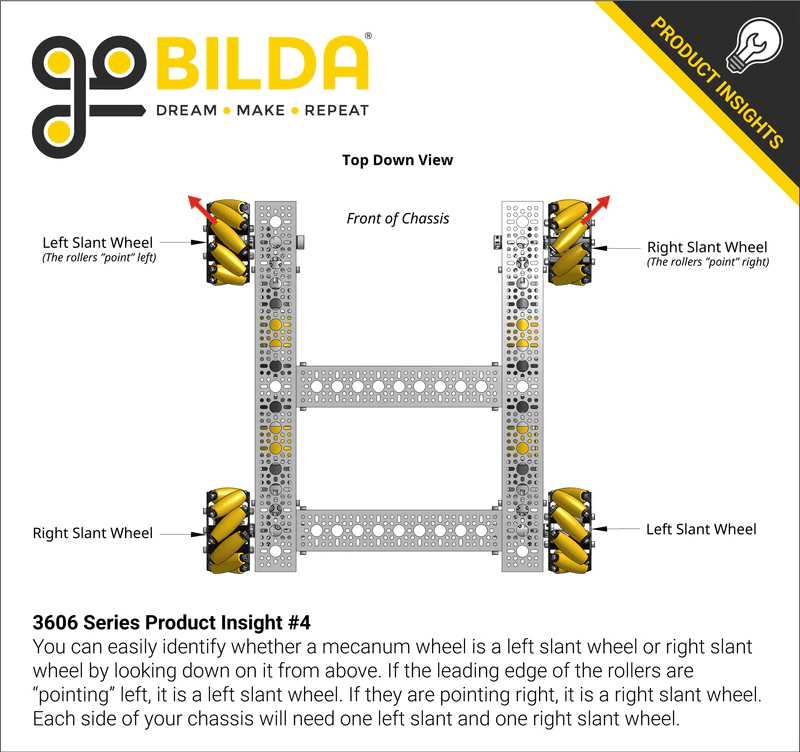
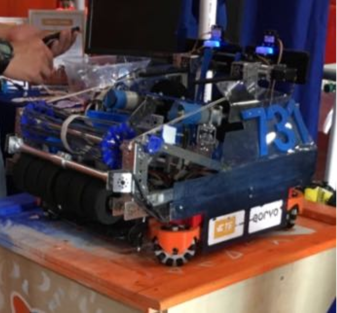

.. include:: <isonum.txt>

Advanced Drivetrains
=====================
   .. warning:: These drivetrains are very complicated compared to the other ones listed prior. It is not recommended to use these options unless you are an experienced team.
   
Butterfly Drive
-------------

Butterfly drivetrains use an actuator (in FTC this is usually a servo) to swap between mecanum wheels and traction wheels. This provides the maneuverability of a mecanum, but with the pushing power of a traction wheel drivetrain. Some teams have even ran different gear ratios on the mecanum wheels versus the traction wheels to have 2 effective drive ratios. Out of all the advanced drivetrains, this is by far the easiest one to execute well.

Advantages
^^^^^^^^^^

- Very maneuverable due to the mecanum wheels.
- Has very strong pushing power due to the traction wheels and the possibility to run a higher gear ratio.
- Simple to package, as it fits into a traditional parallel plate setup for a mecanum or 6 wheel drive layout.

Disadvantages
^^^^^^^^^^^^^

- Uses 4 motors and 2-4 servos, so leaves less hardware for the rest of the robot
- Shifting time between traction and maneuverability
- Fairly expensive to pay for all the components

Differential Swerve
-------

The most common of the swerve drivetrains, differential swerve uses 4 motors to control 2 module swerve in a differential layout.

The biggest advantage of differential swerve is uniform velocity and acceleration in all directions without the use of many motion components. Because of the ability to pivot the wheels in any direction, the robot has no "best direction", and thus is a solid holonomic drivetrain. Another benefit is the added traction due to the use of a traction wheel for power transfer.
 
Differential swerve is not without its drawbacks. For one, the modules have to wait to rotate, which compounded with the high looptimes of the ftc control system causes the delay to rotate modules to be quite substantial. Additionally, Differential swerve often requires complex bevel gears, which can either be machined expensively or 3D printed with low life expectancy. 

 .. note::
 There is a library in development to help address these issues called Photon-FTC (link here soontm),
 
Advantages
^^^^^^^^^^

- Uniform acceleration and velocity
- If designed well, can be fairly inexpensive to manufacture
- Packages very well and doesnt take up much space

Disadvantages
^^^^^^^^^^^^^

- Very hard to design, manufacture, and program
- Module rotation time causes loss in maneuverability
- Cannot handle terrain usually due to the use of unpowered omni wheels to stabilize the robot

   add image

Coaxial Swerve
-------

The lesser used of the swerve drivetrains, coaxial swerve uses multiple independently powered swerve modules.

Though very popular in FRC, coaxial swerve is more niche in FTC due to limitations in number of hardware devices

Though similar in nature, coaxial swerve has many different advantages. For one, coaxial swerve has no unpowered wheels, meaning it has incredibly high traction and can play defense against just about any other robot. It also doesnt suffer as much from control loop limitations, meaning it can be slightly more responsive when doing jerky direction changes. Coaxial swerve is also much easier to design and slightly easier to program, but a durable and robust module can be incredibly fine-tuned. 

Another benefit is the ability to have multiple module configurations. You can run anywhere from 2-4 modules reasonably, and can use a motor or servos to rotate the module. It is generally accepted that a 8 motor swerve with 4 modules is the most powerful configuration, but you leave no motors for the rest of your robot. A good balance can be found in using less than 4 modules, or use servos for rotation.

 .. note::
There are certain configurations that have been proven to work or not. Feel free to ask around before designing your own swerve.
 
Like the other drivetrains, coaxial swerve has many downsides. The most prominent being the use of a significant amount of the avaliable motors and servos. A standard coaxial swerve can use up to 4 motors and 4 servos, with many teams running expensive brushless servos, running 8 total servos, or ditching servos entirely and using all 8 motor slots. Coaxial swerve also suffers the same module rotation time issues, although to a lesser extent than diffy swerve. Coaxial swerve also takes up more space than differential swerve, leading to a different robot layout to cater to the constraints.

Advantages
^^^^^^^^^^

- Uniform acceleration and velocity
- Fairly maneuverable
- Incredible pushing power
- Can handle terrain well

Disadvantages
^^^^^^^^^^^^^

- Uses a significant quantity of hardware devices
- Hard to design and program
- Hard to integrate with the rest of a robot

   add image

